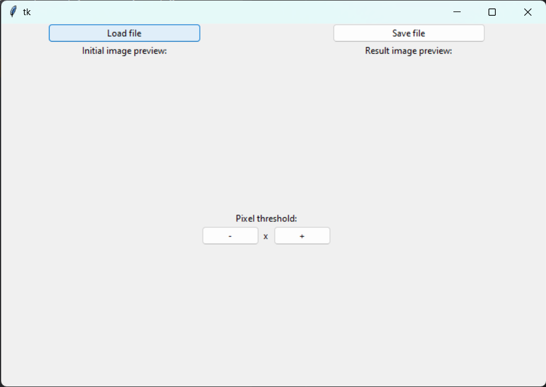
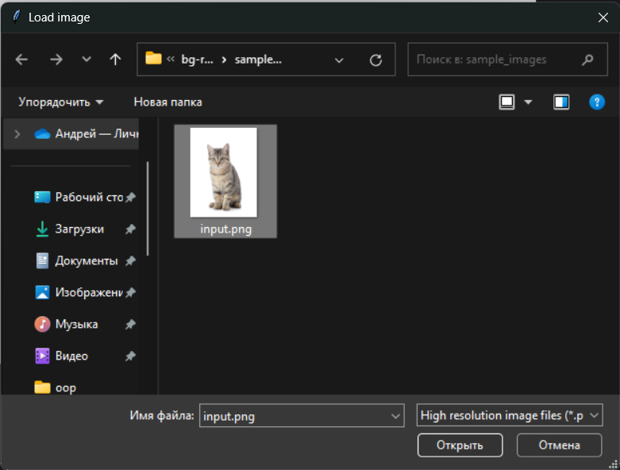
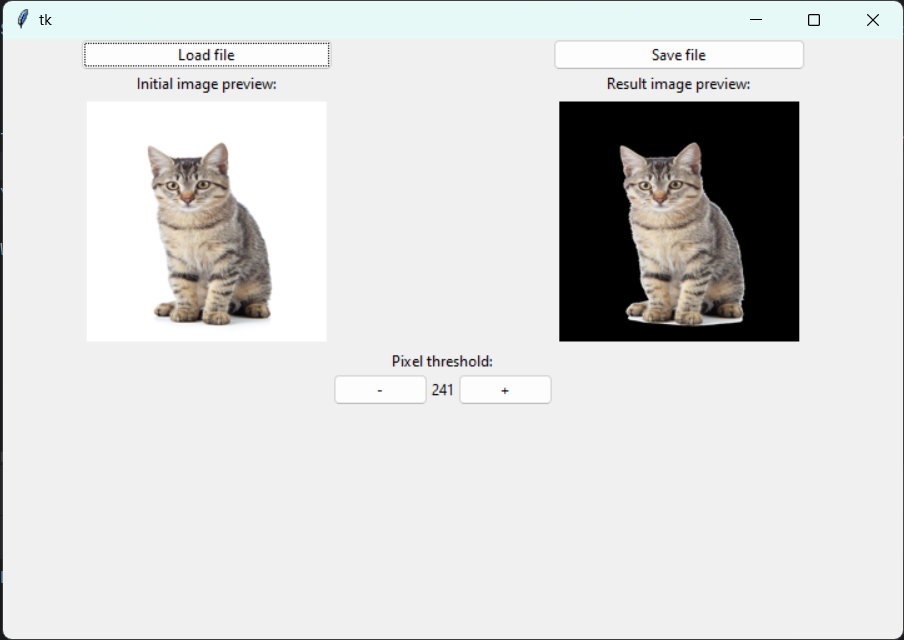

# bg-remove
A computer vision project using Python OpenCV

Removes white background from stock images. Automatically calibrates the pixel threshold, which you may manually adjust later.

Especially effective on stock vector art (see `sample_images/vector_input.png`)

## Installation:
    git clone --single-branch --branch main https://github.com/Misyuriy/bg-remove.git

## Running the project:
    python main.py

## Usage example:

Press "**Load file**":



Select your image (in our case we'll use the ```input.png``` from the ```sample_images```):



The program will automatically set a threshold for the image. You can see the preview of the initial image, as well as the result:



You can adjust the threshold using the **+** and **-** buttons 

When you are satisfied with the result, press "**Save file**"


## Project status
File loading and saving: _complete_

Interface: _complete_

Threshold calibration: _complete_

Manual threshold adjustment: _complete_

